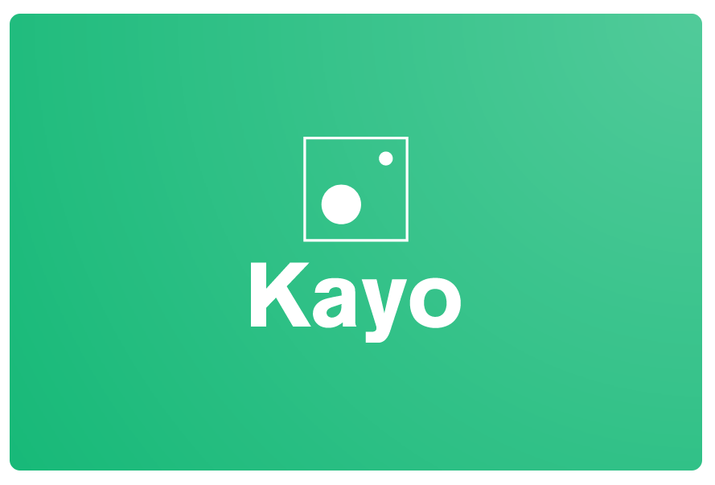

# A professional, personal dashboard

Kayo is a web dashboard app which lets you access your favorite information in a blink of an eye! Enjoy these content while having a simple, non-disruptive browsing experience.

## Features

- Login
  - Login with a secured authentication system
  - Or use your Google account, so you don't have to remember another password!

- Ad-free experience

- Quick access to infos from top-tier services using widgets:
  - Spotify
    - Favorite Artist/Track
    - Artist's top track
  - Weather
    - Condition in a city
    - Temperature in a city
    - Humidity in a city
  - Stock market
    - Condition in a city
  - Github
    - Stats of a repository
    - Badges of a repository's actions

- Managing Services
  - Subscribe to a service, using OAuth2
  - Unsubscribe to a service

- Control over your Widgets
  - Get a list of available widgets from your subscribed services
  - Customize them all!
  - Order them yourself by a simple drag & drop!
  - Modify after creation
  - Delete your widgets

## Tool stack

- Back-end
  - Nest
  - PostGreSQL
  - Swagger
  - Postman (for testing)

- Front-end
  - ReactJS
  - Snowpack

- Deployment
  - Docker

## Documentation

- Back-end
  - Routes documentation